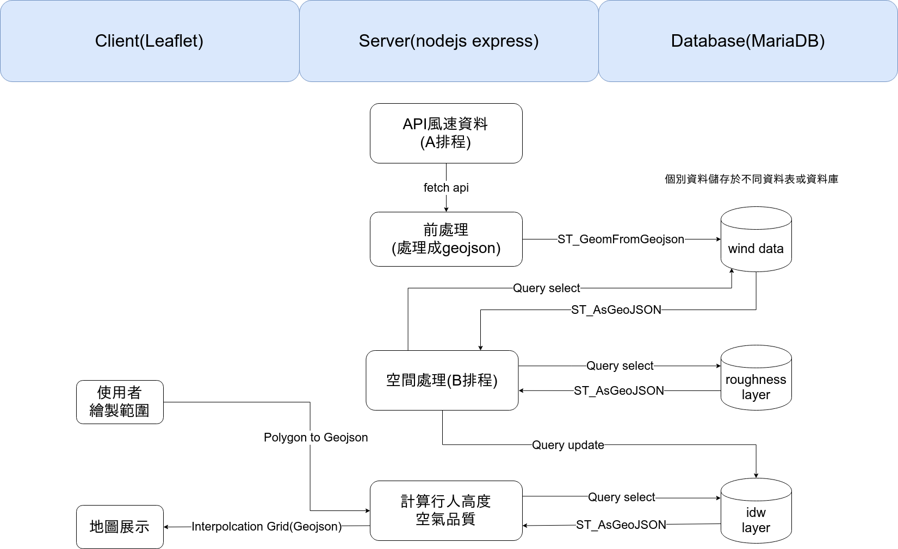

# Real Time Wind Speed

透過WebGIS讓使用者繪製特定的範圍，提供該範圍的行人高度風速資料。

## Get Started

1. 下載專案(可以手動點選download下載zip檔案)

    `git clone https://github.com/YuChunTsao/Real-Time-Wind-Speed.git`

2. 切換至app目錄

    `cd Real-Time-Wind-Speed/app/`

3. 將依賴套件安裝

    `npm install`

## 系統架構圖

create with draw.io

## 伺服器

Nodejs Express

## 資料庫

MariaDB

* [判斷測站不存在才進行insert into](https://www.techonthenet.com/mariadb/exists.php)

## 前端地圖框架

Leaflet

## 空間分析

Turf.js

## 排程

* [node-schedule] (https://www.npmjs.com/package/node-schedule)

## 資料來源

* [自動氣象站-氣象觀測資料](https://opendata.cwb.gov.tw/dataset/observation/O-A0001-001)
* [局屬氣象站-現在天氣觀測報告](https://opendata.cwb.gov.tw/dataset/observation/O-A0003-001)
* 環保署
  * 監測數據
    * https://opendata.epa.gov.tw/api/v1/AQI?%24skip=0&%24top=1000&%24format=json  
  (環保署網頁的來源需要註冊會員，否則每日僅能透過api調用50次。)
    * https://opendata.epa.gov.tw/ws/Data/AQI/?$format=json
  * 站點資訊
    * [空氣品質監測站位置圖](https://opendata.epa.gov.tw/Data/GeoDetails/ATM00477/)
* [校園測站](http://weather.tp.edu.tw/Ajax/jsonp/LastAllEffect.ashx?fbclid=IwAR0pCF_Rb6LUE4KhLU6mQUXQGOS_dX-le9sAJ0xZo6e7EG-YiG7sSLBY2Ik)

---

## 專案建置過程文件

### 已完成

* [nodejs安裝及測試](./doc/Nodejs.md)
* [express安裝及測試](./doc/Express.md)

### 未完成

* [express api設計(controller)](https://developer.mozilla.org/zh-TW/docs/Learn/Server-side/Express_Nodejs/routes)
* [nodejs請求api (node-fetch)](https://www.npmjs.com/package/node-fetch)
* [turf.js空間資料處理](https://turfjs.org/)
* leaflet及turf.js座標系統的轉換及設定
  * [Proj4Leaflet](https://kartena.github.io/Proj4Leaflet/)
  * [turf.js toMercator](https://turfjs.org/docs/#toMercator)
* [leaflet前端地圖頁面展示](https://leafletjs.com/)
* [leaflet使用者繪製功能](http://leaflet.github.io/Leaflet.draw/docs/examples/full.html)
* [mariaDB連線及資料表設計](https://mariadb.com/kb/en/library/getting-started-with-the-nodejs-connector/)
* [mariaDB匯入geojson及空間資料的存取](https://mariadb.com/kb/en/library/geojson/)

## Reference

* [Nodejs](https://nodejs.org/en/)
* [Express/Node introduction](https://developer.mozilla.org/zh-TW/docs/Learn/Server-side/Express_Nodejs/Introduction)
* [Turf.js](https://turfjs.org/)
* [Leaflet](https://leafletjs.com/)
* [The GeoJSON Specification (RFC 7946)](https://tools.ietf.org/html/rfc7946)
* [HERE XYZ: GeoJSON Visualizer](http://geojson.tools/)
* [氣象局測站清單](https://e-service.cwb.gov.tw/wdps/obs/state.htm)
* [中央氣象局自動氣象站觀測資料彙整](http://farmer.iyard.org/cwb/cwb.htm)
