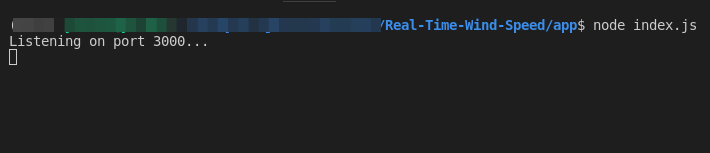
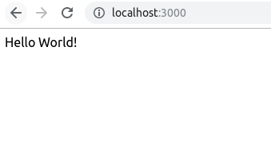
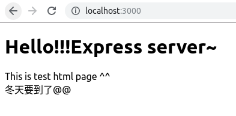

# Express server建立

## 建立應用程式

1. 建立應用程式所要放置的資料夾目錄

    `mkdir app`

    `cd app`

2. 初始化建立package.json檔案，將紀錄該應用程式所使用到的套件。

    `npm init`

   過程中會提醒妳進行相關設定，若無特別需求，預設值即可。

   entry point: (index.js) 為程式的進入點(一切行為從此檔案開始執行的意思)

3. 安裝express

    npm install express --save

4. 於`app`資料夾中新增`index.js`檔案，寫入以下內容後儲存。

    index.js

    ```js
    // 引入express
    var express = require('express');
    var app = express();

    // 根目錄
    app.get('/', function (req, res) {
        res.send('Hello World!')
    })

    // 監聽 3000 port
    app.listen(3000, function() {
    console.log('Listening on port 3000...');
    });
    ```

5. 於專案目錄中透過`cmd`中執行express server

    ```cmd
    C:\Your\Project\Path\app> node index.js
    ```

    

6. 開啟瀏覽器，前往[http://localhost:3000/](http://localhost:3000/)，可以看到index.js回傳給根目錄的內容。

    

## 存取靜態檔案

1. 建立`public`資料夾存放靜態檔案(html, js, css, images ...)

    `public`資料夾底下分別建立`images`, `css`, `js`資料夾進行檔案的管理，並且新增`index.html`作為後續網站的首頁。

    資料夾結構

    ```cmd
        app  
        ├── index.js  
        ├── node_modules
        │   ├── ...
        ├── package.json  
        ├── package-lock.json  
        └── public  
            ├── css  
            ├── images  
            ├── index.html  
            └── js  
    ```

2. 開啟`index.html`輸入測試的內容，存檔後關閉。

    ```html
    <!DOCTYPE html>
    <html>

    <head>
        <title>Real Time Wind Speed</title>
        <meta charset="utf8">
    </head>

    <body>
        <h1>Hello!!!Express server~</h1>
        <div>This is test html page ^_^</div>
        <div>冬天要到了@@</div>
    </body>

    </html>
    ```

3. 修改`index.js`，啟用讀取靜態檔案。

    讀取`public`目錄底下的檔案

    ```js
    var express = require('express');
    var app = express();

    // read static file from a directory named 'public'
    app.use(express.static('public'));

    app.listen(3000, function() {
    console.log('Listening on port 3000...');
    });
    ```

4. 重啟express server(`ctrl + c` 可以終止上一次的運行)

    ```cmd
    C:\Your\Project\Path\app> node index.js
    ```

5. F5刷新頁面或前往[http://localhost:3000/](http://localhost:3000/)，可以看到index.js回傳給根目錄的內容以改變為下圖。

    

## Reference

* [Setting up a Node development environment](https://developer.mozilla.org/zh-TW/docs/Learn/Server-side/Express_Nodejs/development_environment)
