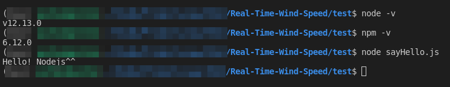

# Nodejs 安裝

1. 前往[nodejs](https://nodejs.org/en/)下載LTS版本。
2. 執行安裝
3. 可以於terminal中使用`node -v`及`npm -v`確認安裝的版本

## 測試

1. 開啟一個新檔案`sayHello.js`輸入`console.log("Hello! Nodejs^^")`後存檔。
2. 於cmd(terminal)輸入`node sayHello.js`
3. 將會看到印出`Hello! Nodejs^^`的字樣。

